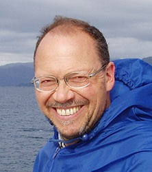

## Emanuele Trucco

It is my great pleasure to be back in person to (clearly retrospectively) give the citation for Manuel Trucco as the 2020 recipient of the BMVA’s Distinguished Fellow Award. Even more appropriate at the dinner for a BMVC that he has kindly helped with the organisation of; this latest example is very much indicative of a long career of service to the computer vision and medical imaging communities (both national and international) that runs alongside his extensive research accomplishments. 

Manuel completed his MSc and PhD at the University of Genova but has been a firm fixture in the UK vision and medical image analysis - he maintains and international flair though as, alongside his Chair in Computational Vision at Dundee and Clinical Research position at NHS Tayside, he is also an Adjunct Professor at the Chinese Academy of Sciences!

Talking of research, his long track record touches almost all of the established topics - from 3D vision and stereo to segmentation and tracking as well as his deep track record in medical imaging. As someone who isn’t always the best at naming things, I am full of admiration that for the later of these topics, he is co-director of the VAMPIRE (Vessel Assessment and Measurement Platform for Images of the Renita) international research initiative! This work has not just led to numerous papers and two textbooks, Manuel has also worked hard to ensure that these methods have been put to good use outside the lab and he routinely works with clinical collaborators and industrial partners to transfer technology; as an example, VAMPIRE has been used in UK and international biomarker studies on cardiovascular risk, stroke, dementia, diabetes and complications, cognitive performance, neurodegenerative diseases, and genetics.

I think there can be no doubt as to his eminent suitability for the Distinguished Fellow award but if further consideration should be sought, I also understand that he is an avid player of the bagpipes - I’m not sure if this is on the cards for after dinner entertainment!

Anyway, far better to hear from Manuel himself, I give you the BMVA Distinguished Fellow for 2020, Manuel Trucco! 

Neill Campbell (BMVA chair)
Roy Davies (DF Committee chair)
