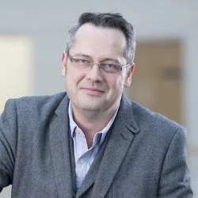

## Richard Bowden

It is my great pleasure to confer the title of BMVA Distinguished Fellow to Professor Richard Bowden in person as BMVC returns to an in-person conference! 

Rich obtained his BSc in Computer Science at the University of London, followed by an MSc at the University of Leeds and then a PhD from Brunel University where he was awarded the BMVA’s Sullivan Thesis Prize. An award that has subsequently been won by two of his PhD students! 

At the University of Surrey, he is Professor of Computer Vision and Machine Learning where he leads the Cognitive Vision Group within CVSSP. His work has covered the whole breadth of computer vision from fundamental topics, such as tracking and detection, to non-verbal communications, such as sign and gesture recognition, lip-reading, all the way to cognitive robotics. He was awarded a Royal Society Leverhulme Trust Senior Research Fellowship in 2013 and made Fellow of the International Association of Pattern Recognition in 2016. A testament to his research is also the regard in which he is held by colleagues and former students; these number over 30, many now with research groups of their own. A notable theme of his work is that it is grounded in practice as well as theory; as an example, I’m sure many of us have enjoyed following his blog on “How to build an autonomous car”..

Over the years he has also dedicated much of his time to service to the research community including serving on the BMVA’s executive committee for many years, serving on program committees for vision conferences including running BMVC; and serving as an associate editor for the journals Image and Vision Computing and IEEE TPAMI.

Throughout his career, Rich has promoted and furthered UK vision research, both nationally and internationally, and long may he continue so to do. Our BMVA Distinguished Fellow for 2021 is Richard Bowden!

Neill Campbell (BMVA Chair)

Roy Davies (DF Committee Chair)
