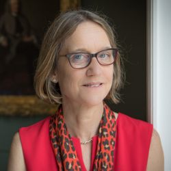

## Alison Noble

Alison Noble is the Technikos Professor of Biomedical Engineering in the Institute of Biomedical Engineering, part of the Department of Engineering Science at the University of Oxford; she is principally renowned for her work on biomedical image analysis. 

Professor Noble is a glowing example of the critical importance of interdisciplinary research with her work spanning the fundamental image formation, domain tailored machine learning, practical engineering considerations and human-centric clinical understanding and decision making. Her contributions span these topics and more and have led to technologically advanced, robust and medically valuable full systems. In an era where the community is expanding rapidly and there is a substantial risk of the field becoming increasingly siloed she is an inspirational example of the need for broad research interests and diverse collaboration.

With numerous achievements across numerous fields I hope it is fair to say that her journey started in computer vision with her Engineering Science undergraduate and PhD on computer vision supervised by Mike Brady; as a pioneer in the field she started her early work, for example finding corners in images, in the days when you often had to draw in diagrams by hand!

Apart from her contributions to low-level computer vision - I first came across her work through friends who were working on Ultrasound - another field where her work is considered foundational.

We come very late to the party with Prof Noble having received many distinguished awards; she was elected a Fellow of the Royal Society in 2017, appointed 
She is a Fellow of the Royal Society, of the Royal Academy of Engineering and of the IET as well as appointed OBE and then CBE in recognition of her services to engineering and biomedical imaging.

In 2019 she was awarded the RS Gabor Medal, “distinction of interdisciplinary work between the life sciences with other disciplines”: “For developing solutions to a number of key problems in biomedical image analysis and substantially advancing automatic extraction of clinically useful information from medical ultrasound scans.”

We are very grateful that Professor Noble is able to receive this award in person and we all look forward to hearing from her; I give you the 2022 BMVA Distinguished Fellow, Alison Noble!

Neill Campbell (BMVA Chair)
Majid Mirmehdi (DF Committee Chair)
