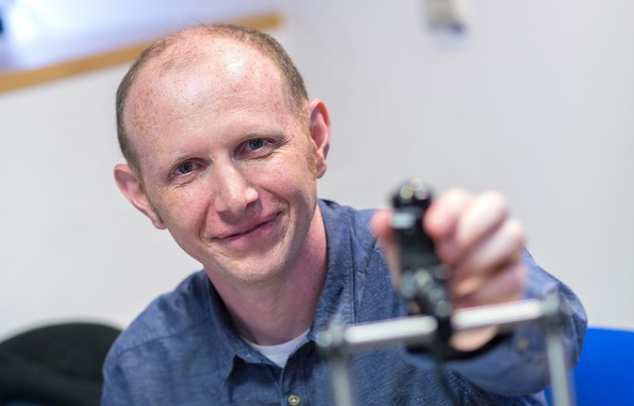

## Andrew Davison

Andrew Davison is Professor of Robotic Vision at Imperial College London where he leads the Dyson Robotics Laboratory. His name is synonymous	with camera based Simultaneous Localisation and Mapping (SLAM) and more recently for his research agenda in Spatial AI as a critical enabling technology for intelligent devices to reason about their location and surroundings. 

For many in our field, Prof Davison is renown as the master of the live demo; a topic that inspires terror in the bravest of PhD students. Again, from my own experience I remember his name spoken in hallowed terms by the next door SLAM group for his mastery of real-time vision and programming skills. His work on MonoSLAM, DTAM, Kinect Fusion, .. were all seminal moments and I can clearly remember the first time I saw the beautiful and insightful demos that pushed the boundaries of what we thought was possible in real-time. Also the desk contents of his lab will be archived in excessive detail for historians of the future!

Another measure of the success of his work has been his dedication to his PhD students who speak incredibly highly of him and have gone on to achieve great things. 

His uncompromising focus on practical systems is something for us to all learn from - his work has had huge industrial impact across the fields of robotics, virtual and augmented reality and spatial reasoning in mobile devices - with Dyson he was critical in the delivery of the company’s first robotic product, the Dyson 360 Eye, which went on sale around the world in 2016 as a ground breaking commercial technology. He is also co-founder of the London based SLAMCore.

Again we are late to the party, Professor Davison was elected a Fellow of the Royal Academy of Engineering in 2017 and of the Royal Society in 2023. He continues to push the frontiers of our field, especially with new hardware such as work on Event Cameras and new architectures such as GraphCore, and creating robust systems for the robotics revolution to come.

We are privileged to have him here this evening and I won’t keep you from hearing from him any longer; I give you the 2023 BMVA Distinguished Fellow, Andrew Davison!

Neill Campbell (BMVA Chair)

Majid Mirmehdi (DF Committee Chair)
