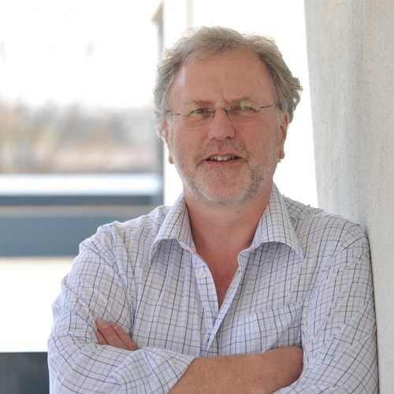

## Adrian Clark

As many of you will know, the BMVA makes an annual award of a Distinguished Fellow of the BMVA in recognition of their services to the British machine vision community. This year it is my privilege to present the award to Adrian Clark.

Adrian received his BSc in Physics from University of Newcastle and his PhD in image processing from Queen Elizabeth College, University of London in 1983. His early post-doctoral research involved parallel image processing (prophetic of how important this topic has become in recent years). This was followed by a position at British Aerospace looking into object recognition. In 1988 he moved to a Faculty position in the School of Computer Science and Electronic Engineering at the University of Essex where he has remained ever since until his recent retirement (for which he is also to be congratulated!).

Adrian’s research has taken him from image and video analysis to remote sensing through to graphics with VR/AR. People often enjoyed visiting his lab and it’s collection of “odd stuff” such as a record player being used as a turn table for data capture and a complex Perl script written for generating unique circular AR-tag like codes in postscript for Augmented Reality.

Throughout his career, Adrian has dedicated a significant proportion of his time to service to the community. From 1991-93 he led the UK’s participation in development of the International Standard for Image Processing and Interchange. Always passionate about evaluation and comparison in vision; he established the influential Pixel mail list (PEIPA) one of earliest internet resources for distributing standard code, datasets and benchmarking, again, a topic of immense importance today!

I always hold particular admiration for researchers who are particularly supportive and helpful to the next generation and for his activities on this front, Adrian is to be particularly commended. Many people I spoke to have stories of how supportive he was early in their careers and he taught for many years at the British Machine Vision Summer School with a particular emphasis on helping the students - from practical illustrations on tcl/tk (I suspect this is a dated reference for this audience now) to a stable feature on testing and evaluation; I don’t know what it says about the BMVA but given my particular interest in uncertainty, this is now a topic that I talk about a lot. So two chairs in succession - perhaps we can leave that to people to infer what they will about the importance of that topic! I should also mention that the first thing that people bring up is how kind and approachable he is, both as a researcher and a teacher.

Adrian is a member of the Institute of Physics where he has served on their Signal Processing, Electronics and Communication Systems Committee but of course, of particular importance is his many years of service to the British Machine Vision Association where he served as secretary, Sullivan Thesis prize secretary and chair from 2013-2020 as my immediate predecessor. I am personally very grateful for the support shown to me by Adrian when I first joined the BMVA committee and enjoyed the lunch discussions (when we used to have meetings in person!) especially about open science. His emails always bring a smile before I even open them due to his established moniker “alien@essex.ac.uk”. 

So, without further ado, I give you the BMVA’s Distinguished Fellow for 2024, Adria Clark!

Neill Campbell (BMVA Chair)

Majid Mirmehdi (DF Committee Chair)
